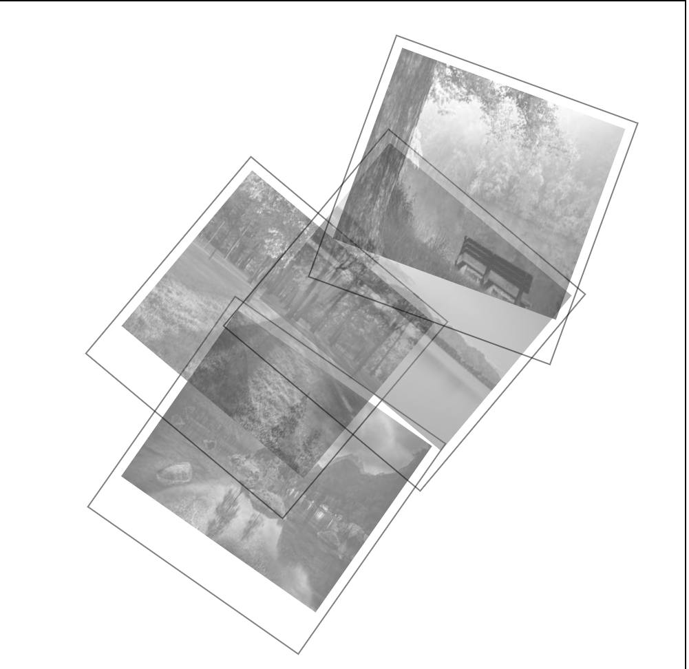
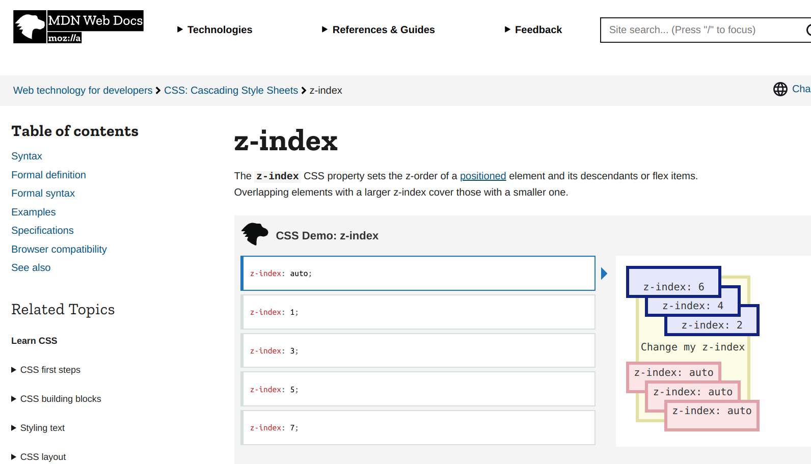

 # My First Gallery wall

*My Gallery wall layout is a selection of four different Natural Scenery Posters. It is creatively arranged using different styling options in CSS.*

> Here, I have used different tools in CSS. Like as follows:
>
> 1. Classes
>
> 2. Group Selectors
>
> 3. Pseudo class 
> - :hover
>
> 4. Z-index
>
> 
>
> 5. Grey scale filter effect
>
> 6. For positioning images
> - top
> - left
>
> 7. Transform transform
>
*My **favorite website** to know more about these properties is:*
[mdn resources](https://developer.mozilla.org/)

[^1]: This is my first project in learning phase.

